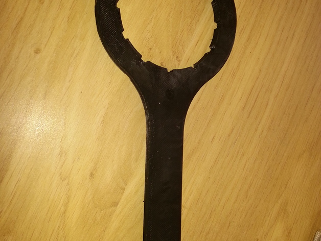
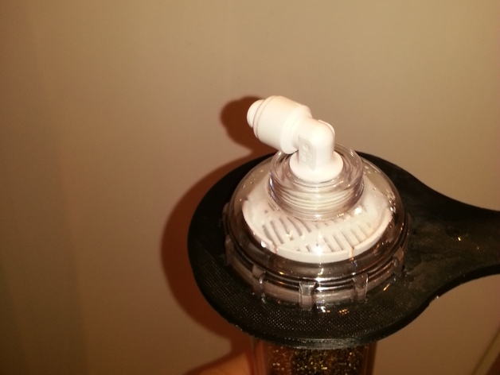

Wrench to open the resin rartridge of an osmoser

To purify water for your fish or coral tank, you need an osmoser.
The one I bought has several cartridges with fibers, and one with resin. Although the fiber cartridges come with a wrench to open them up to renew the fibers, the resin one does not.
And it's really not easy to open without riping your skin apart.
That's the wrench to fix this problem.

